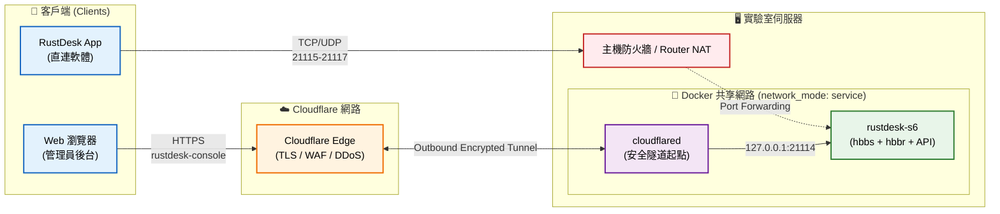
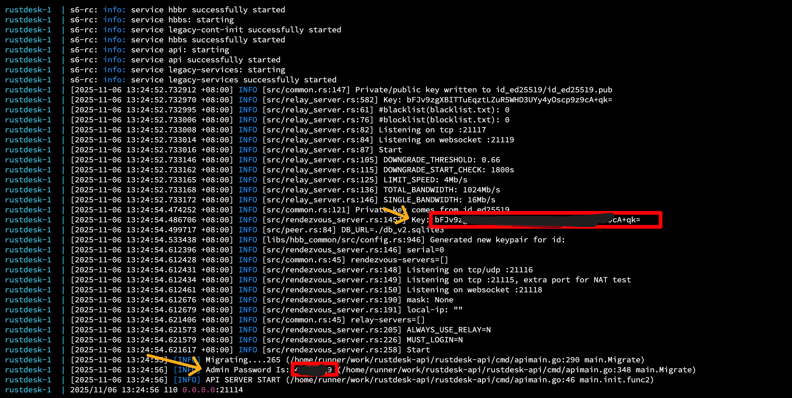

# RustDesk Server — Self-Hosted（社群版）

提供一套低維護成本且具備零信任等級防護的 RustDesk 自託管遠端桌面基礎設施。

可供專案計畫執行時有遠端協作、系統維運需求的使用者設計與使用。本方案提供了一鍵部署配置，支援於**樹莓派 (Raspberry Pi)、NAS 或一般個人電腦 (PC)** 等裝置上進行自託管運作。

本架構整合了 `hbbs`、`hbbr` 節點以及社群版的 Web API 管理後台於單一容器中，同時強制將 Web 後台流量導由 Cloudflare Tunnel (Zero Trust) 進行安全揭露，兼顧效能與安全性。

## 版本選擇

| 版本 | 映像檔 | 裝置限制 | Web 管理後台 | 適用情境 |
|------|--------|:--------:|:--------:|---------|
| [官方開源版](https://github.com/rustdesk/rustdesk-server) | `rustdesk/rustdesk-server` | **無限制** | 無 | 個人使用，不需管理後台 |
| [官方 Pro 版](https://rustdesk.com/docs/en/self-host/rustdesk-server-pro/installscript/docker/) | `rustdesk/rustdesk-server-pro` | Free Tier **3 台**，需購買授權 | 有 | 預算充足的組織 |
| **[社群版](https://github.com/lejianwen/rustdesk-api)（本儲存庫）** | `lejianwen/rustdesk-server-s6` | **無限制** | **有** | **組織 / 實驗室 / 團隊** |

> **本儲存庫使用社群版**，整合映像檔 `lejianwen/rustdesk-server-s6` 將 hbbs + hbbr + API 打包為單一容器，提供與 Pro 版相當的管理功能，且**無裝置數量限制**。
>
> **核心專案來源與致謝（社群貢獻）**：
> - **Server 核心**：[lejianwen/rustdesk-server](https://github.com/lejianwen/rustdesk-server) (基於官方 Server Fork，支援強制登入等進階功能)
> - **API 伺服器**：[lejianwen/rustdesk-api](https://github.com/lejianwen/rustdesk-api/tree/master) (以 Go 語言獨立實作的 API Server)
> - **Web 管理後台前端**：[RustDeskweb](https://cnb.cool/a1007479270/RustDeskweb) (由社群維護的使用者友善 Web UI 介面)

### 社群版 vs Pro 版功能比較

| 功能 | 社群版 (rustdesk-api) | Pro 版 |
|------|:--------------------:|:------:|
| 使用者管理 | 有 | 有 |
| 裝置管理 | 有 | 有 |
| 地址簿 / 群組 | 有 | 有 |
| 登入日誌 / 連線日誌 | 有 | 有 |
| OIDC / LDAP 登入 | 有 | 有 |
| Web Client | 有 | 有 |
| 強制登入才能連線 | 有（`MUST_LOGIN=Y`） | 有 |
| 裝置數量限制 | **無** | 3 台（免費）/ 付費擴充 |
| 授權 | MIT（完全免費） | 商業授權 |
| 官方支援 | 社群 | 官方 |

## 架構概覽



- **rustdesk (S6)**：單一容器整合 hbbs + hbbr + rustdesk-api
- **cloudflared**：Cloudflare Tunnel — 將 Web Console 安全暴露至公網（取代傳統反向代理）

## ⚠️ 核心配置警告

> **安全性優先**：
> 本專案的 `docker-compose.yml` 與 `.env` 內的各項參數（例如：網路模式、憑證隧道、反向代理變數 `PROXY_ENABLE` 及 `TRUST_PROXY` 等）均經過嚴密的安全防護與邊界條件審查。
>
> 這些設定直接關係到**伺服器防護機制**（如防爆破封鎖、真實攻擊者 IP 辨識）與整體網路安全。在不完全了解底層機制的情況下，**請務必保持現有的預設設定**。若因特殊網路環境強烈需要更動，請務必先深入了解其背後牽涉的資安影響分析（詳見 [架構與維運指南](docs/architecture-and-maintenance.md)）。

## 快速開始

```bash
# 1. 設定環境變數
#    CLOUDFLARE_TUNNEL_TOKEN: 從 Cloudflare Zero Trust Dashboard 取得
#    RUSTDESK_API_JWT_KEY: 自訂隨機字串
cp .env.example .env
# 編輯 .env 填入 Token 和 JWT Key

# 2. 啟動服務
docker compose up -d

# 3. 取得公鑰（客戶端設定需要）
#    或至 ./data/server/id_ed25519.pub 檔案查看 (可以用記事本打開)
#    終端機：輸入 `cat ./data/server/id_ed25519.pub`
#    SSH：輸入 `sudo cat ./data/server/id_ed25519.pub`
#    NAS GUI：進入 Container Manager，打開 `rustdesk` 容器的「日誌 (Logs)」頁籤查看。
cat ./data/server/id_ed25519.pub

# 4. 登入 Web Console（透過 Cloudflare Tunnel）
#    網址: https://rustdesk-console.example.com
#    🔑 預設使用者名稱是 admin
#    🔑 密碼和 key 獲取方式：
#       - 終端機：輸入 `docker logs rustdesk`
#       - SSH：輸入 `sudo docker logs rustdesk`
#       - NAS GUI：進入 Container Manager，打開 `rustdesk` 容器的「日誌 (Logs)」頁籤查看。
#    🚨 首次登入後請務必立刻修改密碼！
```



## 客戶端設定

> **使用前須知**：連線伺服器所需的 **ID 伺服器地址**、**API 伺服器地址** 與 **Key（公鑰）**
> 為實驗室內部資訊，請需要使用的夥伴向**實驗室 IT 管理員**申請取得後再進行設定。

| 欄位 | 值 | 說明 |
|------|---|------|
| **ID 伺服器** | `rustdesk-server.example.com` | 直連主機（TCP/UDP） |
| **中繼伺服器** | `rustdesk-server.example.com` | 同主機，可留空 |
| **API 伺服器** | `https://rustdesk-console.example.com` | 走 Cloudflare Tunnel |
| **Key** | `cat ./data/server/id_ed25519.pub` 的輸出 | 向 IT 管理員索取 |

> **ID/中繼伺服器**只填域名，不加 `http://` 或 port。
> **API 伺服器**必須填完整 HTTPS URL。

## 文件索引

| 文件 | 說明 |
|------|------|
| [Server 架設指南](docs/server-setup.md) | 部署步驟、Port/防火牆、Cloudflare Tunnel、安全加固 |
| [架構與維運指南](docs/architecture-and-maintenance.md) | 給 IT 管理員的架構解析、設計權衡及部署後驗證清單 |
| [Windows 客戶端設定](docs/client-windows.md) | 安裝、連線伺服器、常用操作 |
| [iOS 客戶端設定](docs/client-ios.md) | App Store 安裝、設定、行動裝置注意事項 |

## 目錄結構

```
self-host-rustdesk-server/
├── .env                    # Tunnel Token + JWT Key（勿 commit）
├── docker-compose.yml      # Docker Compose (rustdesk-s6 + cloudflared)
├── data/
│   ├── server/             # hbbs/hbbr 金鑰對與資料
│   │   ├── id_ed25519      # 私鑰（絕勿外洩）
│   │   └── id_ed25519.pub  # 公鑰（配發給客戶端）
│   └── api/                # rustdesk-api SQLite 資料庫
├── docs/
│   ├── server-setup.md     # Server 架設指南
│   ├── client-windows.md   # Windows 客戶端設定
│   └── client-ios.md       # iOS 客戶端設定
└── README.md               # 本文件
```

## 相關專案

| 專案 | 說明 |
|------|------|
| [lejianwen/rustdesk-server](https://github.com/lejianwen/rustdesk-server) | 官方 server fork，修復 API 連線逾時、支援強制登入 |
| [lejianwen/rustdesk-api](https://github.com/lejianwen/rustdesk-api) | 社群 Web 管理後台（Go），MIT 授權 |
| [rustdesk/rustdesk-server](https://github.com/rustdesk/rustdesk-server) | 官方開源 server（無 Web 管理後台） |
| [RustDesk Pro](https://rustdesk.com/pricing.html) | 官方商業版（需授權金鑰） |