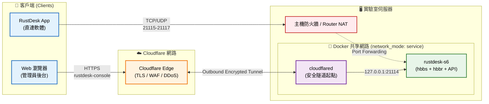

# 架構與維運指南 (Architecture & Maintenance Guide)

本文件專為未來接手管理此伺服器或負責專案部署的 IT 人員編寫，詳細解析核心配置檔 `docker-compose.yml` 與 `.env` 的架構設計、安全考量與維運須知。

> **對於一般使用者**：無需了解此部分內容。若需連線，請直接向實驗室 IT 管理員申請連線資訊（ID 伺服器、API 伺服器與公鑰）及帳號。

---

## 1. 環境變數隔離策略 (`.env`)

所有因部署環境（網域名稱、機密金鑰）而異的設定，已全部抽離至 `.env` 中。此作法確保 `docker-compose.yml` 是無狀態且可公開的版本控管檔。

> **危險標示 (WARNING)**：`.env` 已列入 `.gitignore`。轉移伺服器時，請務必透過安全通道（如 SSH、密碼管理器）傳輸此檔案與 `data/server/` 目錄下的連線金鑰對 (`id_ed25519` 與 `id_ed25519.pub`)。

| 變數名稱 | 填寫規範與維運注意事項 |
|---|---|
| `RUSTDESK_DOMAIN` | **ID/Relay 伺服器網域**（如 `rustdesk-server.example.com`）。<br>⚠️ **設計權衡**：此網域的 DNS A 記錄必須指向伺服器公網 IP，不能經過 Cloudflare Proxy（遇到橘雲圖示需關閉），否則會阻斷 TCP/UDP 打洞與連線。 |
| `RUSTDESK_API_SERVER` | **Web 管理後台 / API 網域**（如 `https://rustdesk-console.example.com`）。<br>⚠️ **維運注意**：必須包含 `https://`，因為客戶端透過此 URL 進行登入與通訊錄同步。此流量透過 Cloudflare Tunnel 處理。 |
| `CLOUDFLARE_TUNNEL_TOKEN` | 負責建立安全隧道的憑證。<br>⚠️ **安全考量**：若外洩，攻擊者可建立惡意實體假冒此伺服器的 Web Console。若有疑慮，請立即從 Cloudflare Zero Trust 儀表板撤銷並重新簽發。 |
| `RUSTDESK_API_JWT_KEY` | 使用 `openssl rand -base64 256` 產生的強隨機字串。<br>⚠️ **潛在風險**：用於簽發客戶端登入的 JWT Token。若金鑰遺失並重新產生，所有已登入的客戶端會被迫登出；若外洩，攻擊者可偽造 Token 存取設備。 |
| `MUST_LOGIN` | 設為 `Y` 時，客戶端未登入將無法發起遠端連線。<br>⚠️ **設計權衡**：大幅提升安全性，避免知道 ID/密碼的外部人士連線。但會增加初次派發客戶端的維運成本（每台都需登入）。可依組織安控級別決定是否開啟。預設為 `N`。 |
| `RUSTDESK_API_APP_REGISTER`| 設為 `false` 關閉開放註冊。<br>⚠️ **維運注意**：強烈建議保持關閉。帳號一律由管理員登入 Web Console 手動建立並派發，避免不明人士註冊後占用資源或探測內部網路。 |

---

## 2. 服務架構設計 (`docker-compose.yml`)

此配置將官方版的多個服務（hbbs, hbbr），透過社群映像檔 `lejianwen/rustdesk-server-s6` 整合為單一容器，並新增 API 功能，同時搭配 `cloudflared` 實現零信任（Zero Trust）架構。

### 邏輯架構圖



### 2.1 RustDesk 核心服務 (`rustdesk` 容器)

整合了 `hbbs` (ID Server)、`hbbr` (Relay Server) 與 API (Web Console) 的 S6-overlay 映像檔。

- **網路映射 (Ports)**：
  - 僅對外映射 `21115-21119` 通訊埠。
  - **堅決不公開映射 21114 (API)**：確保管理後台不會暴露於公網，只能透過內部網路或 Tunnel 存取。
  - **邊界條件**：主機防火牆與路由器**必須允許對外的 `21116/udp` 通行**。UDP 是 RustDesk NAT 打洞與 P2P 連線的關鍵。若遭阻擋，所有連線將被迫走 Relay 中繼，嚴重消耗伺服器頻寬與效能。
- **安全加固 (Security Opt)**：
  - 啟用 `no-new-privileges:true`：防止容器內程序透過 `setuid` 提升權限，有效降低容器逃逸風險。
- **資料庫選擇**：
  - 預設使用 SQLite (`GORM_TYPE=sqlite`) 掛載於 `./data/api`。
  - **設計權衡**：對實驗室/中小型組織而言，SQLite 的效能足以應付數十至數百台裝置的連線，且免去維護額外 MySQL 容器的資源與維運成本。缺點是不利於未來擴展為多節點高可用性 (HA) 架構。若有 HA 需求，需修改環境變數切換為 MySQL。

### 2.2 安全透傳服務 (`cloudflared` 容器)

取代傳統 Nginx 反向代理，使用 Cloudflare Tunnel 將 Web Console 安全地暴露至公網，並享有 Cloudflare 的 WAF 與 DDoS 防護。

- **網路模式 (`network_mode: "service:rustdesk"`)**：
  - **核心設計**：此設定讓 `cloudflared` 容器與 `rustdesk` 容器共享同一個網路命名空間 (Network Namespace)。
  - 這意味著 `cloudflared` 可以直接透過 `127.0.0.1:21114` 存取 `rustdesk` 容器內的 API 服務，無需在 `docker-compose.yml` 中將 `21114` port 暴露給外部網路。
  - **優勢**：此設計取代了繁瑣的 `host` 網路模式，解決了在某些 NAS (如 Synology) 部署時因 Host 模式引起的 Port 衝突問題，同時大幅減少了攻擊面。
- **檔案系統唯讀 (`read_only: true` + `tmpfs`)**：
  - 進一步鎖死容器，強制掛載唯讀根目錄，僅將 `/tmp` 設為記憶體檔案系統 (tmpfs)。即使 Tunnel 遭受零日漏洞攻擊被攻破，攻擊者也無法在容器內寫入後門指令碼或修改設定。

---

## 3. 部署後驗證清單

專案建立或伺服器遷移後，接手的管理員請執行以下驗證步驟，確保架構如預期運作：

1. **部署啟動**：
   ```bash
   cp .env.example .env
   # 確實填寫 .env 內的所有變數
   docker compose up -d
   ```

2. **提取公鑰派發給用戶**：
   系統會在第一次啟動時自動生成連線金鑰。此公鑰須提供給客戶端設定。
   ```bash
   cat ./data/server/id_ed25519.pub
   ```

3. **更改預設管理員密碼（最高優先級）**：
   首次啟動後，立刻前往 `https://rustdesk-console.example.com`。
   - 使用預設帳號：`admin` 登入。
   - 密碼與 Key 獲取方式：
       - 終端機：輸入 `docker logs rustdesk`
       - SSH：輸入 `sudo docker logs rustdesk`
       - NAS GUI：進入 Container Manager，打開 `rustdesk` 容器的「日誌 (Logs)」頁籤查看。
   - 立即於後台將密碼修改為高強度字串。

4. **驗證連線阻斷（防火牆測試）**：
   - 嘗試從外網環境，直接存取伺服器的公網 IP + 21114 Port (例如 `http://<您的伺服器公網 IP>:21114`)。
   - **預期結果**：連線應被拒絕或逾時。這證明 Web Console 沒有意外暴露於公網，唯一合法的管理入口僅能透過 Cloudflare Tunnel 進入。
